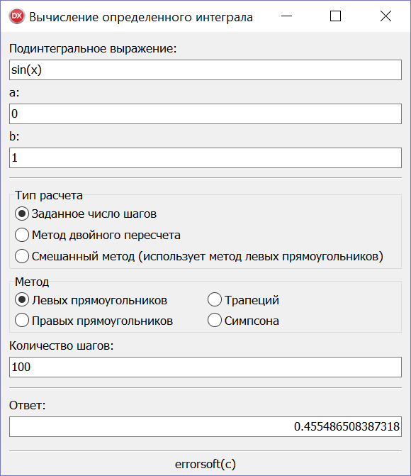

# Integral
 

Пример простого приложения вычисляющего интеграл тремя разными методами.

Вы можете задать свою подинтегральную функцию, в выражении можно использовать следующие функции:
* sin(...)
* cos(...)
* tan(...)
* asin(...)
* acos(...)
* atan(...)
* log(...)
* exp(...)
* sqrt(...)
* abs(...)
* pi
* n!
* x^y

